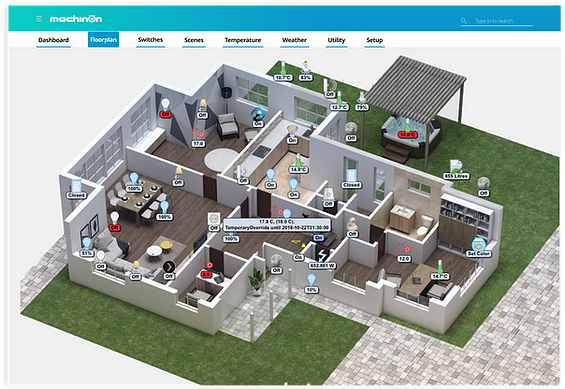
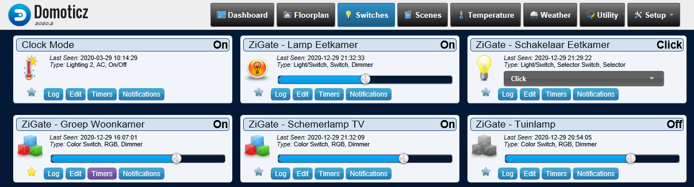

<!--
N.B.: Questo README è stato automaticamente generato da <https://github.com/YunoHost/apps/tree/master/tools/readme_generator>
NON DEVE essere modificato manualmente.
-->

# Domoticz per YunoHost

[](https://dash.yunohost.org/appci/app/domoticz)  

[](https://install-app.yunohost.org/?app=domoticz)

*[Leggi questo README in altre lingue.](./ALL_README.md)*

> *Questo pacchetto ti permette di installare Domoticz su un server YunoHost in modo semplice e veloce.*  
> *Se non hai YunoHost, consulta [la guida](https://yunohost.org/install) per imparare a installarlo.*

## Panoramica

Domoticz is a Home Automation system design to control various devices and receive input from various sensors.
For example this system can be used with: 

* Light switches
* Door sensors
* Doorbells
* Security devices
* Weather sensors like: UV/Rain/Wind Meters
* Temperature Sensors
* Pulse Meters
* Voltage / AD Meters
* And more...


The MQTT broker Mosquitto is integrated into the package and requires its own domain or subdomain. It's an optional setting.
You may also install the [Mosquitto package](https://github.com/YunoHost-Apps/mosquitto_ynh) without using the one provided by domoticz_ynh.

**Versione pubblicata:** 2024.4~ynh1

## Screenshot




## Documentazione e risorse

- Sito web ufficiale dell’app: <https://domoticz.com/>
- Documentazione ufficiale per gli utenti: <https://www.domoticz.com/DomoticzManual.pdf>
- Documentazione ufficiale per gli amministratori: <https://www.domoticz.com/wiki/Main_Page>
- Repository upstream del codice dell’app: <https://github.com/domoticz/domoticz>
- Store di YunoHost: <https://apps.yunohost.org/app/domoticz>
- Segnala un problema: <https://github.com/YunoHost-Apps/domoticz_ynh/issues>

## Informazioni per sviluppatori

Si prega di inviare la tua pull request alla [branch di `testing`](https://github.com/YunoHost-Apps/domoticz_ynh/tree/testing).

Per provare la branch di `testing`, si prega di procedere in questo modo:

```bash
sudo yunohost app install https://github.com/YunoHost-Apps/domoticz_ynh/tree/testing --debug
o
sudo yunohost app upgrade domoticz -u https://github.com/YunoHost-Apps/domoticz_ynh/tree/testing --debug
```

**Maggiori informazioni riguardo il pacchetto di quest’app:** <https://yunohost.org/packaging_apps>
